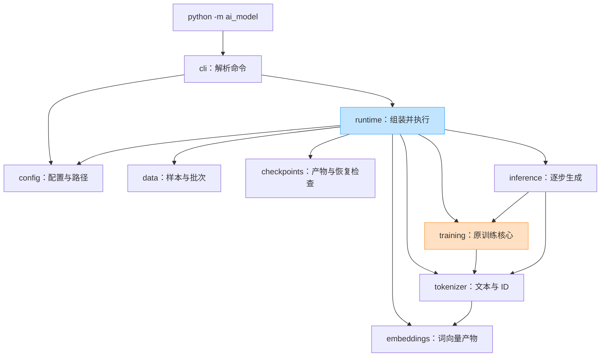
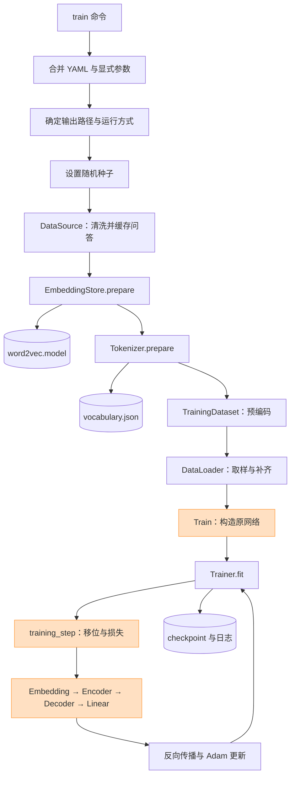
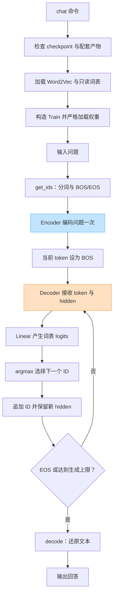
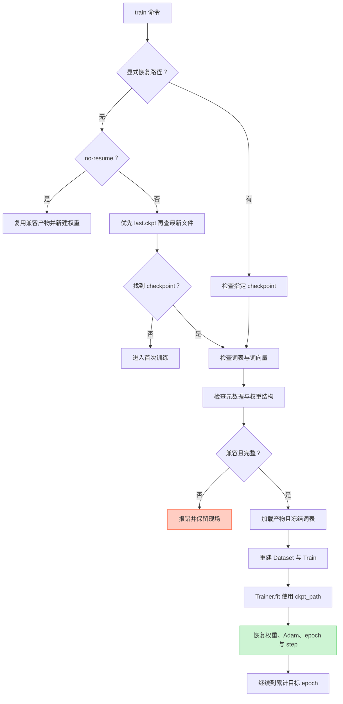

# AI-MODEL 架构与源码阅读手册

这份手册帮助你回答三个问题：一条命令如何启动训练；数据如何变成模型能计算的张量；为什么把代码放进这些模块，而不是继续增加类和目录。

本次整理的边界是接通数据准备、训练、续训与原有聊天流程。`Train` 类的网络、`forward()`、`training_step()`、损失和优化器计算保留原义。它仍是 Word2Vec 初始化的 Embedding 加 Encoder–Decoder GRU，不因为工程结构更清楚就变成了经过质量验证的聊天系统。

## 1. 建议的阅读顺序

第一次只读第 2—4 章，找出命令、配置和对象组装的位置。第二次读第 5—7 章，用小问答追踪 ID 与形状。第三次再读第 8—11 章，理解产物、恢复和设计概念。云端使用时把第 12 章作为排错索引。

每读一个模块，先写下四句话：它接收什么；交出什么；会不会读取网络或写文件；如果失败由谁处理。能说清这四点，比背诵设计模式名称更能帮助你修改项目。

## 2. 项目结构：按责任分开，保持浅层

```text
ai_model/
    __main__.py       python -m ai_model 的入口
    cli.py            解析 train/chat 命令与显式参数
    config.py         配置对象、校验与运行路径
    runtime.py        组装对象并执行完整流程
    data.py           读取问答、准备语料、Dataset 与补齐
    embeddings.py     Word2Vec 的准备、加载和词向量矩阵
    tokenizer.py      文本分词、词表、token ID 与解码
    training.py       保持计算不变的 Train 类
    inference.py      单步生成与终端对话
    checkpoints.py    查找 checkpoint 与兼容性检查
docs/
    architecture-guide.md
    diagrams/        四份可编辑 Mermaid 源码
```

`ai_model` 是一个包，包内每个 `.py` 文件是一个模块。文件夹名称本身不能建立良好架构；依赖方向、输入输出和副作用边界才决定结构是否清楚。

### 2.1 旧位置与新职责

| 原位置或历史位置 | 新位置 | 迁移原因 |
| --- | --- | --- |
| `CLI/cli.py` | `ai_model/cli.py`、`__main__.py` | 给命令一个稳定入口，参数解析不承担训练 |
| `Core/model.py` | `ai_model/runtime.py` | 原 `Model` 主要在分派运行模式，名称容易与神经网络混淆 |
| `Config/model.yaml` | YAML 配置与 `ai_model/config.py` | 配置读取、校验、路径处理集中管理 |
| `Data/provider.py`、历史 `data_provider.py` | `ai_model/data.py` | 对调用方提供规范问答，隐藏数据来源差异 |
| `Core/tokenizer.py`、历史 `tokenizer.py` | `ai_model/tokenizer.py` | 集中文本与 ID 的约定 |
| `Core/word2vec.py`、历史 `wordvec.py` | `ai_model/embeddings.py` | 显式区分训练词向量、加载产物和取向量 |
| `Train/train.py` 中 `Train` | `ai_model/training.py` | 只迁移和修正导入，保留核心计算 |
| `Train/train.py` 中 `TrainingDataset` | `ai_model/data.py` | 数据编码和批次组织归数据层 |
| 历史 `train_cloud.py` | `cli.py`、`runtime.py`、`checkpoints.py` | 分离命令、组装和恢复检查 |
| 历史 `chat.py` | `ai_model/inference.py` 与运行组装 | 对话拥有已经加载的模型，不重新定义训练模型 |

原工作区处于未完成的目录迁移状态。表中的“历史”表示从已有版本提取并适配的实现依据，不表示那些已删除入口被原样恢复。正式入口统一为 `python -m ai_model train` 和 `python -m ai_model chat`。

### 2.2 模块依赖图

箭头读作“左侧模块依赖右侧模块提供的能力”，不是“数据一定只往这个方向流”。例如训练时 loss 会返回调用方，但依赖仍然从运行组装层指向训练模型。



运行组装层依赖多个模块是有意的：总要有一个地方把对象接起来。如果把相同组装逻辑塞进 Tokenizer、Dataset 和模型构造函数，依赖并不会消失，只会变得难以观察。

## 3. 一条训练命令实际经历什么

在项目根目录执行下面的命令时，Python 把 `ai_model` 当作包加载，并运行它的 `__main__.py`：

```bash
python -m ai_model train --help
```

这条命令只用于查看训练参数。开始训练时，CLI 读取 YAML 并应用本次显式写出的命令行参数，然后把有效配置交给运行组装层。

正常训练路径依次承担这些责任：

1. **CLI 确定意图。** 当前命令是 train 还是 chat；哪些选项是你明确覆盖的。
2. **配置层形成有效配置。** 把字符串、数字和路径转换成下游能使用的配置；错误尽早暴露。
3. **运行层选择模式。** 首次训练、从 checkpoint 续训，或者复用现有词向量并重新初始化网络。
4. **数据层产生问答。** 保留稳定的清洗与配对规则，训练核心不需要知道数据来自本地文件还是远程数据集。
5. **词向量与分词器准备产物。** 先得到 Word2Vec，再建立或读取词表，使 ID 和词向量矩阵的行号一致。
6. **Dataset 编码，DataLoader 组织批次。** 问答只预编码一次；每个 batch 再按其中最长的序列补齐。
7. **构造 Train。** 读取词向量矩阵，创建 Embedding、Linear、Encoder 和 Decoder。
8. **Trainer 驱动训练。** 它调用 `training_step()`，执行反向传播与 Adam 更新，并按配置写日志和 checkpoint。



`Train` 与 `Trainer` 只差几个字母，但职责完全不同。`Train` 是你写的网络及一步训练计算；Lightning 的 `Trainer` 是驱动训练循环的对象。`runtime` 负责把两者接起来。

### 3.1 构造对象不应该让昂贵工作悄悄发生

`Tokenizer` 和 `EmbeddingStore` 的普通构造过程用于接收已经准备好的依赖。需要下载数据、训练词向量或写入产物时，通过 `prepare()` 这类明确的方法表达。`load()` 表达“已有产物必须存在”，不会因为文件缺失而悄悄开始训练。

这使调用者能从一行代码判断成本。聊天运行路径只加载训练完成的产物，构造 `ChatSession` 不会获取训练数据。

### 3.2 命令行覆盖要保留“有没有明确提供”的区别

假设 YAML 已经设置 `batch_size: 16`，用户没有写 `--batch-size`，CLI 不应拿自己的默认 4 覆盖 YAML。只有显式给出 `--batch-size 8` 才覆盖它。

因此需要区分“没有提供参数”和“参数值恰好等于默认值”。最终顺序是：项目基础默认值 → YAML → 本次明确提供的 CLI 选项。有效配置写入运行记录后，你才能解释某次训练实际用了什么。

## 4. 主要 API：输入、返回、调用者和副作用

本章按责任阅读，不要求一次记住所有签名。私有辅助方法以源码为准；下表聚焦组装流程直接使用的接口。

### 4.1 数据来源与批次

| API | 输入与返回 | 主要调用者 | 副作用与错误边界 |
| --- | --- | --- | --- |
| `DataSource(dataset, max_dialogs=10000, dataset_config=None, dialog_field="dialog")` | 接收数据来源及字段约定；返回数据源对象 | 训练运行层 | 数据位置、字段、格式和有效对话数量不满足要求时应报错 |
| `DataSource.get_pairs()` | 返回顺序明确的 `(question, answer)` 对 | `runtime`，随后传给 Dataset | 首次需要读取和清洗数据；可复用已准备结果 |
| `DataSource.load_word_data()` | 返回供 Word2Vec 使用的分词语料 | `EmbeddingStore.prepare()` | 与问答准备共用既有清洗、分词约定，避免两个入口使用不同文本规则 |
| `TrainingDataset(pairs, tokenizer)` | 输入问答序列和 tokenizer；把每对问答编码为两个 `torch.long` 张量 | 训练运行层 | 预编码会占用内存；构造时不训练网络 |
| `dataset[index]` | 返回一对未补齐的 1D ID 张量 | DataLoader | 越界索引按容器规则报错 |
| `dataset.collate_fn(batch)` | 返回 `question_ids, answer_ids, question_lengths` | DataLoader | 对当前批次补齐；长度来自补齐前的问题 |

拆出 Dataset 后，它不再通过 `tokenizer.data_provider` 间接寻找语料。调用方直接把 `pairs` 给它。这样你测试补齐逻辑时，只需要两组字符串和一个分词器，不必搭建数据下载流程。

### 4.2 词向量与分词器

| API | 参数与返回 | 主要调用者 | 副作用与错误边界 |
| --- | --- | --- | --- |
| `EmbeddingStore.prepare(provider, path)` | 从 provider 的语料准备或读取 Word2Vec，返回 store | 首次训练组装 | 必要时训练并写文件；语料达不到既有最小词频时失败 |
| `EmbeddingStore.load(path)` | 从已有 Word2Vec 文件返回 store | 续训、聊天 | 文件缺失、无法加载或维度不兼容时失败；不会训练新产物 |
| `Tokenizer.prepare(store, vocabulary_path, max_sequence_length=64, allow_vocabulary_updates=True)` | 接收 store 与词表路径，返回 tokenizer | 首次训练组装 | 按允许更新的策略建立或读取词表；需要更新时写产物 |
| `Tokenizer.load(store, vocabulary_path, max_sequence_length=64)` | 返回使用现有词表的 tokenizer | 续训、聊天 | 不扩充词表；缺失、不合法或特殊 ID 错误时失败 |
| `tokenizer.get_ids(text)` | 字符串 → 含 BOS/EOS 的 `list[int]` | Dataset、ChatSession | 分词和截断；未知词映射为 UNK；不更新词表 |
| `tokenizer.decode(ids)` | 整数迭代对象或张量 → 字符串 | ChatSession | 跳过 PAD/BOS，遇 EOS 停止；非法 ID 类型失败 |
| `tokenizer.get_vector(vocabulary)` | token→ID 映射 → `[V,D]` 浮点矩阵 | `Train.__init__()` | 保持原词向量初始化规则；会消耗 Torch 随机数状态 |

特殊 ID 固定为：`<PAD>=0`、`<UNK>=1`、`<BOS>=2`、`<EOS>=3`。普通词的 ID 必须唯一、连续。词表大小 V 由实际映射得到，不能在 YAML 手填一个与词表无关的数字凑形状。

`max_sequence_length` 是包含 BOS/EOS 在内的最大总长度。设置为 64，普通 token 最多占 62 个位置。它限制编码输入的长度，聊天的 `max_new_tokens` 则限制模型新生成的步数，两者不是同一个参数。

### 4.3 训练模型

| API | 参数与返回 | 调用关系 | 行为 |
| --- | --- | --- | --- |
| `Train(vocab_size, pad_id, tokenizer, learning_rate=0.002)` | 返回 LightningModule | 由运行层构造 | 校验 V、PAD 和学习率；创建冻结 Embedding、两个 GRU 和 Linear |
| `forward(question_ids, decoder_input_ids, question_lengths)` | 返回 `[B,T,V]` logits | `training_step()` 通过 `self(...)` 调用 | 问题按真实长度打包，Decoder 接收 Encoder hidden |
| `training_step(batch, batch_idx)` | 返回标量 loss 张量 | Lightning Trainer 调用 | 切出目标输入与标签、计算交叉熵、记录 loss 与 lr |
| `configure_optimizers()` | 返回 Adam | Lightning Trainer 调用 | 使用模型参数与保存的学习率，不增加调度器 |

`training_step()` 依赖 Lightning 附加的优化器与日志环境，因此不能把 `model.training_step(batch, 0)` 当作普遍适用的普通函数调用。独立检查网络计算时可以调用 `model(...)`；检查真实训练生命周期时要让 Trainer 驱动。

### 4.4 推理会话

| API | 参数与返回 | 调用者 | 副作用与错误边界 |
| --- | --- | --- | --- |
| `ChatSession(model, tokenizer)` | 持有已加载模型与 tokenizer | 聊天运行层 | 构造时不训练、不下载数据 |
| `session.generate(question, max_new_tokens=50)` | 返回形如 `[1, 1+N]` 的 ID 张量；首位为 BOS，`N ≤ max_new_tokens` | `begin_chat()` 或程序调用者 | 使用模型当前设备、切换 eval、在 inference_mode 下贪心生成；空白问题或非正上限失败 |
| `session.begin_chat(max_new_tokens=50, typing_delay=0.05)` | 无返回值；启动终端对话 | 聊天运行层 | 读标准输入、写标准输出；exit/quit/退出、EOF 或中断结束会话 |
| `resolve_device(requested_device)` | `"auto"` 或设备字符串 → `torch.device` | 聊天运行层 | auto 按 CUDA、MPS、CPU 探测；显式请求不可用设备时失败 |

把 ChatSession 放到独立模块后，调用者可以拿同一个已训练模型生成文本，而不必把“聊天是一种训练模型”的继承关系写进结构。

## 5. 用两条小问答追踪 token ID

以下词表与分词结果是**专门用于说明形状的教学例子**，不代表 jieba 一定对所有文本给出这个分词结果，也不代表你的实际词表就用这些 ID。

| token | ID |
| --- | ---: |
| `<PAD>` | 0 |
| `<UNK>` | 1 |
| `<BOS>` | 2 |
| `<EOS>` | 3 |
| 你 | 4 |
| 好 | 5 |
| 我 | 6 |
| 很 | 7 |

设第一对问答为“你 好”→“我 很 好”，第二对为“你”→“好”；这里的空格只用于展示我们已经选定的 token 边界。

```text
问题 1 tokens: 你 好       → IDs: [2, 4, 5, 3]
答案 1 tokens: 我 很 好    → IDs: [2, 6, 7, 5, 3]

问题 2 tokens: 你          → IDs: [2, 4, 3]
答案 2 tokens: 好          → IDs: [2, 5, 3]
```

Dataset 保存四个独立的一维长整型张量。此时没有人为把所有样本补到配置上限；`max_sequence_length` 是截断上限，不等于每个样本的实际长度。

当这两个样本进入同一个 batch：

```text
question_ids = [[2, 4, 5, 3],
                [2, 4, 3, 0]]           shape = [2, 4]

answer_ids   = [[2, 6, 7, 5, 3],
                [2, 5, 3, 0, 0]]        shape = [2, 5]

question_lengths = [4, 3]                shape = [2]
```

长度 `[4, 3]` 包含 BOS/EOS，不包含补出来的 PAD。Encoder 用这组长度识别每个问题到哪里结束；不能根据补齐后的宽度 `[4, 4]` 来冒充实际长度。

### 5.1 从答案构造输入与标签

训练代码做两次切片：

```python
decoder_input_ids = answer_ids[:, :-1]
labels = answer_ids[:, 1:]
```

对应到例子：

```text
decoder_input_ids = [[2, 6, 7, 5],
                     [2, 5, 3, 0]]      shape = [2, 4]

labels            = [[6, 7, 5, 3],
                     [5, 3, 0, 0]]      shape = [2, 4]
```

第一条答案的四个时间步分别是：看到 BOS 预测“我”；看到“我”预测“很”；看到“很”预测“好”；看到“好”预测 EOS。这就是输入和目标错开一位的原因。

第二条样本的后两个标签为 PAD，交叉熵通过 `ignore_index=pad_id` 忽略它们。PAD 在矩阵中占位置，目的是让 batch 形状统一；它没有提供有效的下一个词训练目标。

### 5.2 词表 ID 与词向量行号

`token_to_id["你"] == 4` 意味着查词向量矩阵第 4 行。不是第 4 个字符，也不是第 4 个样本。

假设 V=8、D=128：

```text
embedding.weight                   shape = [8, 128]
embedding(question_ids)            shape = [2, 4, 128]
embedding(decoder_input_ids)        shape = [2, 4, 128]
```

两个不同词表即使同样有 8 个词，也不能随意共用一个 checkpoint。如果“你”从 ID 4 换到 ID 6，张量维度仍然能匹配，但每一行的语言含义已经改变。形状正确只能证明能进行某些矩阵计算。

## 6. 训练核心：从 batch 到 loss

记号如下：B 为批量大小，Q 为本批问题宽度，A 为本批答案宽度，T=A−1，V 为词表大小，D 为词向量维度。当前历史词向量设置的 D 为 128，GRU hidden size 与 D 相同。

| 阶段 | 输入 | 输出 | 为什么需要 |
| --- | --- | --- | --- |
| 问题 Embedding | `[B,Q]` IDs | `[B,Q,D]` | 把离散编号变成可计算向量 |
| `pack_padded_sequence` | 问题向量与 `[B]` 长度 | PackedSequence | 避免把补齐位置当成问题内容继续编码 |
| Encoder GRU | 打包的问题 | hidden `[1,B,D]` | 把每条问题的有效序列汇总成状态 |
| 答案输入 Embedding | `[B,T]` IDs | `[B,T,D]` | 为 Decoder 提供真实答案前缀 |
| Decoder GRU | 答案输入向量与 Encoder hidden | `[B,T,D]` | 逐时间步生成状态 |
| Linear | `[B,T,D]` | `[B,T,V]` logits | 给词表中的每个候选 token 一个分数 |
| 交叉熵 | `[B×T,V]` logits 与 `[B×T]` 标签 | 标量 loss | 衡量每个有效位置的预测与真实下一词的差异 |

`batch_first=True` 指输入输出张量把 batch 放到第一个轴；它不会把 GRU 的 hidden 改成 `[B,1,D]`。这里的 hidden 仍是 `[层数×方向数,B,D]`，当前为 `[1,B,D]`。

`question_lengths.cpu()` 是为了向序列打包操作提供 CPU 长度张量；问题向量本身可以继续位于模型使用的计算设备上。

### 6.1 logits 不是 token ID，也还不是概率

对某个位置，Linear 输出 V 个实数。如果 V=8，那么该位置的输出形如 `[0.4, -1.2, 0.1, ...]`，每个分数对应词表的一项。

训练直接把 logits 交给 `CrossEntropyLoss`。不要先在模型输出上加 softmax 再当作“工程优化”，那会改变损失接收的数学量。推理用 argmax 选择最大分数的位置，才得到一个 token ID。

### 6.2 反向传播、参数与冻结

`loss.backward()` 沿计算图求可训练参数的梯度，Adam 使用梯度和自己的历史状态更新参数。这些步骤由 Lightning Trainer 驱动。

`Embedding.from_pretrained(..., freeze=True)` 表示训练过程中不更新词向量权重。Encoder、Decoder 和 Linear 仍然可以学习。Word2Vec 的准备阶段与 GRU 的梯度训练是两个流程，不能因为两者都使用“训练”这个词就把它们混成一件事。

日志 `normal_loss` 是当前训练代码按 epoch 聚合的训练损失；`lr` 是优化器实际学习率。这里没有凭空添加 validation loss，因此不能从日志推断模型在未见过的问题上表现良好。

### 6.3 为什么连随机数调用都要保护

历史词向量矩阵构造先调用正态随机初始化，再覆盖已知词向量；PAD 行为零，UNK 使用词向量均值。特殊 token 或没有对应词向量的位置可能保留随机初始化值。

提前调用一次 `get_vector()` 做检查，会推进随机数状态，从而影响稍后 Linear/GRU 的初值。即使 `Train` 的代码一个字没改，同一个 seed 也不再一定对应同一组初始网络参数。

因此需要区分三种验收：核心类 AST 不变；同输入、同初始权重的计算结果不变；同种子和同准备顺序的初始权重不变。这三者相关，但不能互相替代。

## 7. Teacher forcing 与聊天推理

训练时，每个时间步的 Decoder 输入来自真实答案。预测错了，下一时间步仍然看到真实的前一个词。这种安排称为 teacher forcing。

聊天时没有真实答案可供使用。模型先看到 BOS，生成一个词，再把自己刚生成的词作为下一步输入。这种把输出反馈为输入的逐步生成称为自回归生成。

| 比较项 | 当前训练 | 当前推理 |
| --- | --- | --- |
| 下一步输入 | 真实答案的上一个 token | 模型自己刚生成的 token |
| Decoder 执行方式 | 一次接收完整的答案前缀张量 | 循环执行一个 token |
| Encoder | 对补齐的问题 batch 按长度打包 | 对单条问题编码一次 |
| 停止依据 | 由训练答案长度和 PAD 决定有效目标 | 预测 EOS 或达到生成上限 |
| 参数更新 | Trainer 反向传播并更新 | `eval()` 与 `inference_mode()` 下不更新 |



### 7.1 Decoder hidden 必须接着传

生成循环同时维护 `current_id` 和 `decoder_hidden`。当前 ID 表示这一步输入的词，hidden 保存前面生成过程累积的状态。

如果每轮都重新使用 Encoder 初始 hidden，就会丢失 Decoder 已经生成的上下文。如果每轮重新编码问题，通常是重复工作。当前实现编码问题一次，并保留每一步 Decoder 返回的新 hidden。

`decoder_output[:, -1, :]` 取最后一个时间步的状态；这一步只输入一个 token，因此 Decoder 时间轴长度为 1。Linear 映射成词表分数后，`argmax(..., keepdim=True)` 保留 `[1,1]` 的形状，方便继续喂回 Decoder。

### 7.2 可运行与会回答之间的距离

训练 loss 下降，说明模型越来越能预测训练时看到的目标 token。它没有单独证明：能回答改写的问题；能正确处理未知词；不会重复；面对训练集外的问题能保持可靠。

工程验收可以证明模型被正确加载、推理反馈链没有断、EOS 和最大步数能停止。聊天质量需要独立的未见样本和具体评价标准。不要把“能输出字符串”当作理解问题的证据。

## 8. 产物、权重与 checkpoint

| 名称 | 内容 | 用途 | 不能替代什么 |
| --- | --- | --- | --- |
| 词表 `vocabulary.json` | token 与 ID 的映射 | 编码输入、解释输出 | 不能替代网络权重 |
| Word2Vec 产物 | 词及对应向量 | 初始化 Embedding、准备兼容 tokenizer | 不能替代训练后的 GRU/Linear |
| `state_dict` | 按参数名称组织的张量 | 将网络参数装入同结构模型 | 单独不能完整恢复 Adam 和训练进度 |
| Lightning checkpoint | 模型状态、超参数及训练恢复信息 | 完整续训，或者提取权重用于聊天 | 不能自动证明外部词表与它属于同一次训练 |
| 运行元数据 | 有效配置、词表摘要及产物信息 | 追踪来源，检查新运行产物是否混用 | 缺少历史记录时不能凭空追溯身份 |
| CSV 日志 | step/epoch、loss、lr 等标量 | 观察训练过程 | 不能替代 checkpoint |

模型参数名保留原来的 `embedding.*`、`linear.*`、`encoder.*`、`decoder.*`。这与 Python 模块移动是两回事：把类从一个文件移到另一个文件，不必把保存的张量键全部改名。

`Train` 保存的超参数包含 `vocab_size`、`pad_id`、`learning_rate`；tokenizer 被明确排除，所以恢复时仍需用正确产物重新建立 tokenizer。`embedding.weight` 虽然冻结，仍在 state dict 中，需要正常保存和恢复。

### 8.1 续训与重新开始

续训走 `Trainer.fit(..., ckpt_path=...)`，使 Lightning 恢复网络参数、优化器状态及训练进度。只把 `state_dict` 装回模型后重新创建一个 Adam，更接近“用旧权重开始另一段训练”，不能声称完整续训。

`max_epochs` 表示累计目标轮数。已经完成 2 轮，恢复时设为 3，意味着继续到第 3 轮；它不表示自动再跑 3 轮。如果目标已经达到，不进行新的更新是合理结果。



恢复选择遵循显式 checkpoint 路径优先，其次自动优先 `last.ckpt`，再考虑同一搜索位置内最新 checkpoint。显式指定的文件不存在或选中的产物不兼容时，失败需要暴露，不能偷偷换成另一个模型继续。

`--no-resume` 表示重新初始化网络与优化器，同时可复用尚未绑定 checkpoint 的兼容词表和词向量。它不是清空目录命令，也不会删除旧文件；如果目标目录已经包含任何 checkpoint，程序直接拒绝启动。新权重实验应选择新的输出目录，避免“最新检查点”跨实验混用。

### 8.2 旧产物兼容性有边界

检查特殊 ID、词表连续性、向量维度和权重形状能发现很多错误，但相同大小的两张不同词表仍可能都通过形状检查。

对于有新元数据的运行，可以比较记录的摘要判断词表是否变化。旧产物没有这个记录，只能报告实际可验证的条件；不能把“读取成功”写成“已确认强绑定”。

恢复时不要扩充词表。因为 V 决定 Embedding 行数和 Linear 输出维度，新加一个词就会改变参数形状；即使不改变 V 而只调换 ID，词义映射也会改变。

## 9. 架构概念：在这份代码里各指什么

### 9.1 职责、内聚与耦合

“职责”是一个模块因为什么原因需要修改。例如要支持一种新的数据文件，首先查看 data；想调整终端逐字输出，查看 inference；改变损失函数则会触及受保护的 training。

“内聚”表示放在一起的代码共同服务一个责任。词表校验、编码和解码放在 tokenizer，相关性很强。

“耦合”表示一处变化会牵动另一处的程度。旧 Dataset 要访问 `tokenizer.data_provider.get_pairs()`，知道了 tokenizer 内部还持有 data_provider。新 Dataset 直接接收 pairs，就减少了对这条内部结构的依赖。

降低耦合不是消灭依赖。Dataset 仍依赖 tokenizer 能把文本变成 IDs；这是完成其任务所需的明确依赖。

### 9.2 组合与继承

继承常用于“这个类型必须遵守父类协议”。`Train(L.LightningModule)` 需要被 Trainer 按 Lightning 生命周期调用，因此继承有直接用途。`TrainingDataset(Dataset)` 为 DataLoader 提供对应的数据接口，也有明确用途。

Tokenizer 需要词向量，并不意味着 Tokenizer 本质上是一种 Word2Vec。采用组合后，Tokenizer 持有 store，通过它获取向量能力，而不用继承词向量训练、绘图等不属于文本编码责任的方法。

```python
# 概念片段：表示对象关系，不承担完整运行组装。
store = EmbeddingStore.load(word2vec_path)
tokenizer = Tokenizer.load(store, vocabulary_path)
session = ChatSession(model, tokenizer)
```

这里 store、model 都在外部准备好再传入。你可以分别检查对象，并在测试时替换依赖。

### 9.3 依赖注入

依赖注入在这里就是“把对象需要使用的东西作为参数传进来”。不要求专门的框架。

```python
dataset = TrainingDataset(pairs, tokenizer)
```

`pairs` 和 tokenizer 是 Dataset 的依赖。它不需要自己找配置文件、下载数据、猜测全局路径。测试者也能给它两对很小的问答，专门观察 collate 的输出。

应当能解释依赖是什么，再决定是否注入。为了使用术语而给每个整数配置都做一个 Provider 类，会增加阅读负担。

### 9.4 Provider 与 Factory

Provider 提供调用者需要的资源或数据。在本项目里，DataSource 对上游提供规范问答，可以承担数据 Provider 的角色。调用者只关心 `get_pairs()` 的结果，不必知道原始数据格式。

Factory 负责根据输入构造合适对象。`EmbeddingStore.prepare()` 根据现有文件和数据准备对象，属于有实际用途的构造入口。完整运行由 runtime 组装，不需要为每个类再写一层 Factory。

未来如果确实出现三种实现而且调用者需要可替换，例如本地文件、对象存储、流式数据库都提供同一套问答接口，可以再考虑单独的 `build_data_source(config)`。只有一个稳定实现时，一个普通构造函数通常更容易学习和维护。

压力测试一个新抽象时，先回答：现在存在几个实现；哪条修改需求需要切换它；抽象后减少了哪些调用方的知识。如果回答只剩“更工业化”，还没有证明它值得加入。

### 9.5 配置对象、运行层与副作用

配置对象保存已经解释好的选择；运行层依据这些选择执行。把设置保存在配置里，不等于让配置对象自己启动训练。

副作用包括下载数据、写词表、保存 checkpoint、打印和读终端输入。它们不一定坏，但应该在能从调用名称和流程图看见的位置发生。清晰的副作用边界使 `--help`、导入模块和配置校验不会意外触发昂贵计算。

## 10. 读源码时不要跳过的三个交界

### 10.1 数据到 tokenizer

问答文本必须使用同一套清洗和分词规则。若词向量语料把标点删掉，而模型训练编码保留标点，未知词分布就会改变；这样的“清理文本”已经改变模型输入。

当前整理保留既有数据配对、清洗、jieba、BOS/EOS 和截断语义。扩展数据能力时，应把编码前后的最小例子写出来，再评估对已有词表和 checkpoint 的影响。

### 10.2 tokenizer 到模型

必须保证 ID 的含义和词向量行号一一对应。`get_vector()` 接收整个 token→ID 映射，是为了按 ID 放置每一行。直接按 Word2Vec 内部迭代顺序拼矩阵，不一定等于 tokenizer 的顺序。

### 10.3 checkpoint 到推理

加载成功只是第一步。接着要确认 tokenizer 使用对应词表、模型设备正确、生成过程中保留 Decoder hidden，并用与训练一致的编码规则处理问题。

聊天只需要已训练产物；如果聊天路径缺文件后去训练一个新 Word2Vec，再强行加载旧 checkpoint，程序可能仍能推进，但产物来源已经变得不可信。因此缺失产物应直接修复路径或补回原产物。

## 11. 如何验收工程整理

验收要从结构到行为逐层进行。下面先解释各层证据能证明什么，再记录本次实际结果。

| 层次 | 检查什么 | 能证明什么 |
| --- | --- | --- |
| 语法与导入 | 模块可解析，统一入口能输出 help | 包结构与基本导入链成立 |
| 核心保护 | Train 类 AST 与原基线一致 | 网络与训练函数的代码没有被重写 |
| 数据契约 | 同问答的 IDs、PAD、长度和 batch 顺序一致 | 数据迁移没有悄悄改模型输入 |
| 初始化等价 | 同 seed、同词向量与相同调用顺序的参数一致 | 外围准备未改变原网络初始化 |
| 计算等价 | 同输入权重的 logits、loss、梯度及 Adam 一步结果一致 | 数学计算保持一致 |
| 真实保存恢复 | 临时 CPU 小数据训练，落盘后继续，step 与 Adam 状态延续 | 训练生命周期可恢复 |
| 推理等价 | 同权重和输入生成同样的 ID 序列 | 原贪心解码行为保留 |
| 产物保护 | 错误词表、缺失文件、无匹配元数据等场景按预期拒绝或明确提示 | 错配问题没有被静默掩盖 |

`fast_dev_run` 对快速发现训练入口问题有用，但它不能代替真实保存 checkpoint 后再恢复的测试。临时数据和输出应放在隔离位置，避免测试污染正式模型产物。

### 11.1 本次实际验证结果

2026-09-18 在项目现有 Python 3.9 虚拟环境中完成 29 项离线和 CPU 测试：

- `Train` 类 AST 与整理前基线相同；相同 seed 的初始化、相同权重下的 logits、loss、梯度和一步 Adam 更新均精确一致。
- 数据清洗、相邻问答配对、jieba、特殊 ID、截断、PAD、真实长度和随机向量调用顺序均有回归检查；远程数据使用模拟对象，没有在测试中下载数据。
- 配置覆盖、相对路径、检查点选择、损坏文件不回退、产物摘要和旧检查点能力边界均已检查。
- 真实 CPU 小数据运行完成第 1 个 epoch 并写出 `last.ckpt`，随后通过 `Trainer.fit(..., ckpt_path=...)` 恢复到累计第 2 个 epoch；global step 与 Adam step 增长，冻结 Embedding 逐元素未变。
- 聊天命令严格加载同一套 checkpoint、词表和 Word2Vec，在 CPU 上进入并正常退出交互；原生成循环与整理前基线产生相同 ID。

这些结果证明工程链条和原计算语义成立。没有执行 Hugging Face 在线下载、云端 GPU 长训练或聊天质量评估，因此不能据此声称云端资源设置或回答质量已经验证。

在本地 CPU 上通过小规模流程验证，不等于已经在云端 GPU 上验证了驱动、显存、并行设备配置或长时间恢复。云端实际训练状态应另行记录。

## 12. 云端使用与排错

### 12.1 先确认路径持久性，再扩大训练

云端环境至少要区分代码目录、原始数据目录与训练输出目录。checkpoint、词表、Word2Vec、运行记录与日志应保存在停止实例后仍然存在的持久目录。

基础默认值采用小 batch 和零 DataLoader worker，便于先验证流程。云端实际资源由显式参数配置：GPU 是否可用、设备数量、batch 大小、worker 数量和 precision。机器核数多，不代表把 worker 数写到几百就一定更快。

先跑少量数据的完整训练与保存，确认 checkpoint 可以被下一次命令续训、能被 chat 加载，再逐步增加数据量和 batch。每次只调一个主要资源参数，才能判断速度或内存变化来自哪里。

### 12.2 常见现象与定位顺序

| 现象 | 优先检查 | 不应立即得出的结论 |
| --- | --- | --- |
| `No module named ai_model` | 是否在项目根目录、是否使用安装该包的解释器 | 不能直接认定模型代码错误 |
| 数据下载失败 | 数据标识、配置名、网络与缓存权限 | 不能通过改 GRU 解决 |
| 本地数据没有有效问答 | 实际字段、对话类型、清洗后内容、至少两轮文本 | 文件存在不代表格式符合契约 |
| Word2Vec 词表为空 | 语料规模和词频是否达到原 `min_count` | 不应默默把最小词频改成 1 |
| 找到 checkpoint 但缺词表 | 输出目录和完整产物是否一起迁移 | 不能临时生成新词表冒充原词表 |
| 参数 shape 不匹配 | V、D、state dict 键与词表来源 | 不应加 `strict=False` 隐藏结构错配 |
| 续训没有新增 step | checkpoint 已完成多少轮；目标 `max_epochs` 是否更大 | 不一定是恢复失败 |
| 恢复后 lr 与新配置不同 | 优化器恢复状态与显式覆盖策略 | 不能只看 YAML 就认定实际学习率 |
| CUDA 显存不足 | batch、序列长度、V、其他进程与设备选择 | 不意味着要先改模型架构 |
| CPU 占用高但 GPU 等待 | 数据准备是否未结束、worker 与 batch 成本 | 不能靠无限增加 worker 解决 |
| loss 有限但回答重复 | 训练覆盖、未见样本、teacher forcing 与自反馈差异 | 不能声称模型已理解问题 |

### 12.3 产物复制要按一套复制

迁移云端训练结果时，把选中的 checkpoint、对应词表、Word2Vec 和运行元数据一起复制。单独复制 `last.ckpt` 后随手借用另一目录的词表，是最容易出现“能加载但词义错了”的操作之一。

`last.ckpt` 的 last 是保存策略给出的名称；文件修改时间的最新也只是文件属性。它们都不能自动代表回答最好。如果以后要选择最好模型，需要先定义独立评估指标，再设计保存策略，这超出本次整理范围。

## 13. 自己动手验证理解

这些练习不要求修改核心训练代码。

1. 在第 5 章例子里把第二个答案增加一个 token，手写新的 `answer_ids`、输入和标签，检查 T 是否变化。
2. 解释为什么 `question_lengths` 不等于补齐矩阵的第二个维度；再指出错误长度会把哪个 PAD 当成内容。
3. 假设把词表的 ID 4 与 ID 6 对调而不改权重，说明为什么 shape 检查仍可能通过，语言含义却已经改变。
4. 沿一次 `chat` 路径找出所有会写文件的位置。若发现缺产物会自动下载或训练，核对它是否违反只加载已有产物的设计。
5. 从 `training_step()` 找到唯一的目标移位位置，解释为何不能在 Dataset 再移位一次。
6. 写出“加载旧权重”和“完整续训”在 Adam 状态、epoch、global step 上的差别。
7. 给一个模块提出新类之前，先写出它的输入输出、现有实现数量和真实调用者。若现有函数已经表达清楚，就保留函数。

学习架构时，最有价值的结果是能够预测一个改动会影响哪里。例如“增加词表”会影响 tokenizer、Embedding 与 Linear 的形状、checkpoint 兼容；“改变终端打印延迟”只影响 inference 的显示行为。这种影响范围判断，才是你在项目里逐步建立的工程能力。
